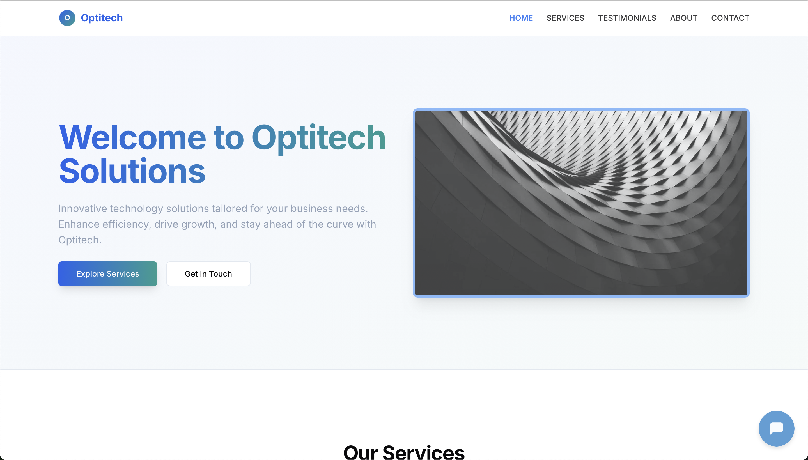

<a id="readme-top"></a>

<details>
  <summary>Table of Contents</summary>
  <ol>
    <li>
      <a href="#about-the-project">About The Project</a>
      <ul>
        <li><a href="#built-with">Built With</a></li>
      </ul>
    </li>
    <li><a href="#usage">Usage</a>
      </ul>
    </li>
    <li>
      <a href="#getting-started">Getting Started</a>
      <ul>
        <li><a href="#prerequisites">Prerequisites</a></li>
        <li><a href="#installation">Installation</a></li>
      </ul>
    </li>
    <li><a href="#contributing">Contributing</a></li>
    <li><a href="#license">License</a></li> 

  </ol>
</details>

<!-- ABOUT THE PROJECT -->
## About The Project

[](docs/company_page.png)

This mobile-responsive company website provides key business information while enabling seamless visitor interaction. Its standout feature is an AI-powered virtual assistant that answers product, service, and policy queries through an intuitive chat interface. The site includes standard sections—homepage, about us, products/services, contact page, and FAQ—all optimized for any device. With clean navigation and smart AI integration, it delivers a modern user experience that efficiently connects customers with company information. The assistant guides users through processes like form submissions and information searches, combining traditional web content with intelligent conversational support.

### Key Features:
- ✅ This is a single page application.
- ✅ Has one-page scrolling.
- ✅ Uses React for rendering.
- ✅ Uses vite for building.
- ✅ Uses Cloudflare for CDN.
- ✅ Uses Botpress for AI webchat.
- ✅ Has dark mode.

This project was built with Firebase Studio.

<p align="right">(<a href="#readme-top">back to top</a>)</p>

<!-- USAGE EXAMPLES -->
## Usage

To start the app:
1.  Run `npm run dev` on your terminal
2. Then visit `http://localhost:3000` on your browser.

<p align="right">(<a href="#readme-top">back to top</a>)</p>

<!-- BUILT WITH -->
### Built With

This project was built with:

#### Frontend
- React – UI development library.
- Vite - Build tool.
- Cloudflare - CDN.
- Botpress - Webchat.
- Tailwindcss – CSS Framework for developing responsive websites.
- Shadcn - An adaptable component library for using Tailwind CSS and React.

<p align="right">(<a href="#readme-top">back to top</a>)</p>

<!-- GETTING STARTED -->
## Getting Started


### Prerequisites

Before starting the application, ensure you have the following installed:

* Node.js – Download [https://nodejs.org/en](https://nodejs.org/en)
* npm (Node Package Manager) – Included with Node.js installation.
* Docker - Download [https://www.docker.com/](https://www.docker.com/) (optional, to run using docker)

## Installation
Install project dependencies on your local machine. These commands install the necessary packages and their dependencies. Run the application using Docker or without Docker.

### Frontend
1. Go to project directory
    ```sh
   cd company-profile
   ```
2. Install dependencies
   ```sh
   npm install
   ```
3. Run products using npm
   ```sh
   npm run dev
   ```
Run project using docker:

1. Go to project directory
    ```sh
   cd company-profile
   ```

2. Build and run frontend
   ```sh
   docker build -t company-profile .
   docker run -p 3000:3000 company-profile
   ```

<p align="right">(<a href="#readme-top">back to top</a>)</p>

<!-- LICENSE -->
## License

Distributed under the Apache License 2.0. See `LICENSE.txt` for more information.

<p align="right">(<a href="#readme-top">back to top</a>)</p>


